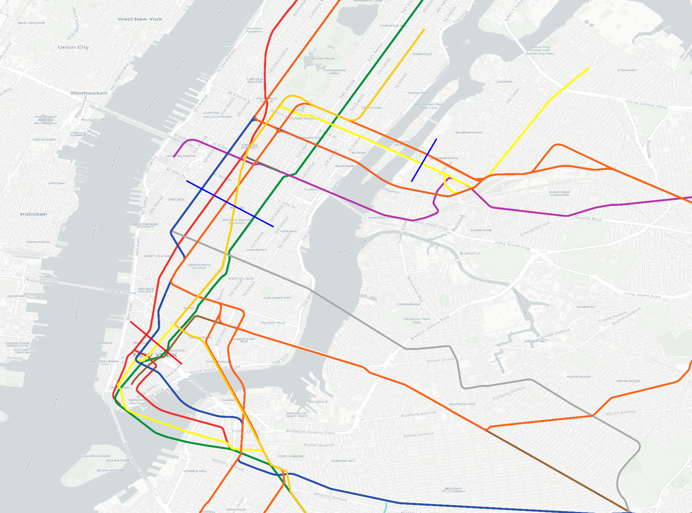

# Select Lines By Drawing

## Plugin Description:

The Feature Line Selector plugin for QGIS empowers users with an intuitive tool for selecting features based on their spatial relationships. This plugin enables users to draw a line on the map canvas, and it automatically selects all feature lines that intersect with the drawn line, and removes from the selection lines that do not intersect with the other drawn lines.

Screenshot:

